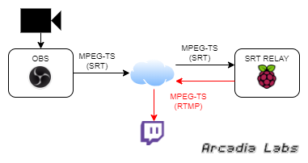
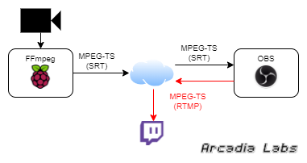

# A Raspberry Pi based SRT streaming machine
Recently there has been a massive rise in the popularity of live streaming video. Platforms like [Twitch](https://www.twitch.tv) host streams not only from gamers, but from software developers as well.

Using OBS on a gaming PC to stream to Twitch is quite easy, there are a lot of tutorials on the Internet/Youtube. However, streaming from the outside or from a remote location, using an unstable internet connection (3G/4G for an example) is often subject to lag and disconnections.

This is where the SRT (Secure Reliable Transport) protocol comes into play. SRT provides connection and control, reliable transmission similar to TCP. However, it does so at the application layer, using UDP protocol as an underlying transport layer. It supports packet recovery while maintaining low latency. [Wikipedia link](https://en.wikipedia.org/wiki/Secure_Reliable_Transport)

But, there is one issue : Twitch, Youtube and the other streaming platforms use RTMP protocol and don't support SRT (yet).

### A Raspberry Pi based SRT Relay to Twitch

So, if you want to stream from your random internet connection, you have to stream using SRT protocol to a relay, and this relay has to send this stream to the streaming platforms using RTMP and your high bandwidth internet connection.

Here is a very simple diagram :

  

About the relay, it's quite easy to set up a PC with OBS acting as a relay. But the PC needs to be quite powerful to be able to capture, decode, re-encode and send the stream inside OBS. Using the right tools, this task could be done using a low power Raspberry Pi 4 (4Gb of RAM in my case) : I could re-stream a 1080p/30fps stream with no problem.

To build your own Raspberry Pi based SRT Relay to Twitch, follow [this guide](https://github.com/ArcadiaLabs/raspberry_srt_relay_to_twitch/blob/main/SRT_Relay2Twitch/SRT_RELAY_2_TWITCH.md)

### A Raspberry Pi based SRT streamer to OBS

It also works the other way : a Raspberry Pi could stream a webcam (or picamera) to a remote OBS using SRT. This remote OBS will catch the SRT stream inside a scene, and then will stream to Twitch (or Youtube) using its high bandwidth Internet connection.

Here is another simple diagram :

  
  
To build your own Raspberry Pi based SRT streamer to OBS, follow [this guide](https://github.com/ArcadiaLabs/raspberry_srt_relay_to_twitch/blob/main/SRT_Streamer2OBS/SRT_STREAMER_2_OBS.md)

