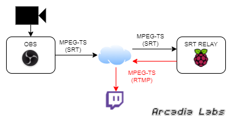
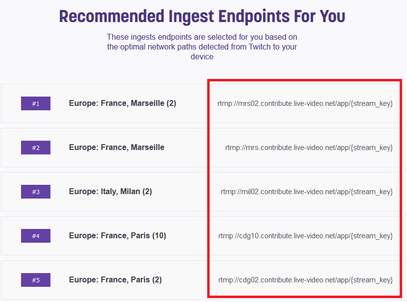
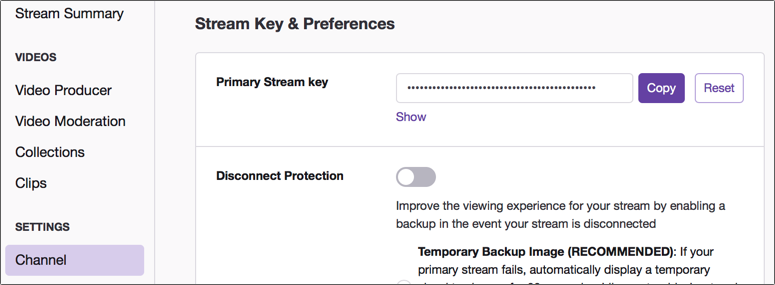

# A Raspberry Pi based SRT Relay to Twitch
Recently there has been a massive rise in the popularity of live streaming video. Platforms like [Twitch](https://www.twitch.tv) host streams not only from gamers, but from software developers as well.

If you want to stream your gameplay from a gaming PC using OBS and your high bandwidth internet connection, it's pretty easy. However, if you want to stream from the outside using a data plan, it becomes quite difficult. The 3G/4G/5G is often too unstable with a too low bandwidth to stream with a sufficient quality, and the stream often drops.

This is where the SRT (Secure Reliable Transport) protocol comes into play. SRT provides connection and control, reliable transmission similar to TCP. However, it does so at the application layer, using UDP protocol as an underlying transport layer. It supports packet recovery while maintaining low latency. [Wikipedia link](https://en.wikipedia.org/wiki/Secure_Reliable_Transport)

But, there is one issue : Twitch, Youtube and the other streaming platforms use RTMP protocol and don't support SRT (yet).

So, if you want to stream from your random internet connection, you have to stream using SRT protocol to a relay, and this relay has to send this stream to the streaming platforms using RTMP and your high bandwidth internet connection.

Here is a very simple diagram :

  

About the relay, it's quite easy to set up a PC with OBS acting as a relay. But the PC needs to be quite powerful to be able to capture, decode, re-encode and send the stream inside OBS. Using the right tools, this task could be done using a low power Raspberry Pi 4 (4Gb of RAM in my case). I could re-stream a 1080p/30fps stream with no problem.

## Install the right FFmpeg binary on the Raspberry Pi

First, install the right FFmpeg binary using [this guide](https://github.com/ArcadiaLabs/raspberry_srt_relay_to_twitch/blob/main/FFmpeg_INSTALL.md)

## Configure Twitch

You will need a Twitch account, a streaming key and your nearest ingest endpoint. The ingest endpoint is a URL where you send your video and audio data to, and ideally you want the one closest to your location.

* Go to [stream.twitch.tv/ingests](https://stream.twitch.tv/ingests/) and find the ingest endpoint nearest to you. This site will show the recommended ones, and it will be something like `rtmp://mrs02.contribute.live-video.net/app/{stream_key}`. Make a copy of this value somewhere.

  

* Head to [twitch.tv](https://www.twitch.tv) and sign up or sign in

* Select your avatar in the top-right hand corner and select *Creator dashboard*

* Select *SETTINGS -> Channel* to find your Primary Stream key. Copy this value using the **Copy** button.
  
  

## Get and configure the relay script

Get the relay script using :

    $ wget https://github.com/ArcadiaLabs/raspberry_srt_relay_to_twitch/raw/main/SRT_Relay2Twitch/srt_relay.sh

### Configure the relay script

You will have to edit some variables inside the script to suit your own setup. So open it in nano :

    $ nano srt_relay.sh
    
Edit the "localip" and "port" variables with the Raspberry Pi local IP and the listen port. The listen port could be anything between 10000 and 65536.

The "endpoint" variable should be set to the ingest endpoint you noted earlier, without the {stream_key} part. So if your endpoint is `rtmp://mrs02.contribute.live-video.net/app/{stream_key}`, then the endpoint variable should be `rtmp://mrs02.contribute.live-video.net/app/`

The "streamkey" variable should be set to the Primary Stream key you found earlier.

Now, save and exit the script using `<CTRL+O>`, `<ENTER>`, `<CTRL+X>`

### Make the script executable
Make the script executable using :

    $ chmod +x srt_relay.sh

**_To be continued..._**
